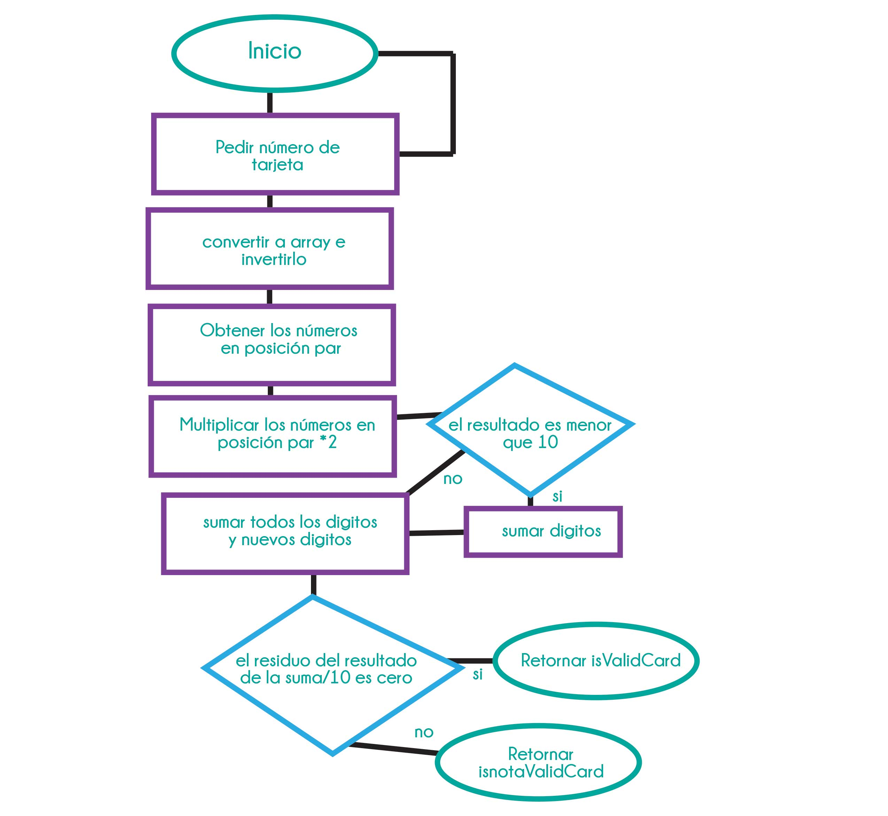

#Tarjeta de crédito válida

Crea una web que pida, por medio de un prompt(), el número de una tarjeta de crédito y confirme su validez según el algoritmo de Luhn. Lee este blog que explica cómo funciona el algoritmo de Luhn.

Consideraciones Específicas

Tu código debe estar compuesto por 1 función: isValidCard
El usuario no debe poder ingresar un campo vacío

#Pseudocódigo

1. Por medio de un prompt preguntar por el número de tarjeta
2. Convertir los números ingresados a un array. 
3. Invertir el array de los números de la tarjeta.
4. Tomar todos los números en posiciones pares y multiplicarlos por 2.
5. Los números que duplicamos que exceden 9, es decir tienen dos dígitos deben ser reducidos a un dígito sumando ambos numeros.
 Comprobar si es una tarjeta válida

 